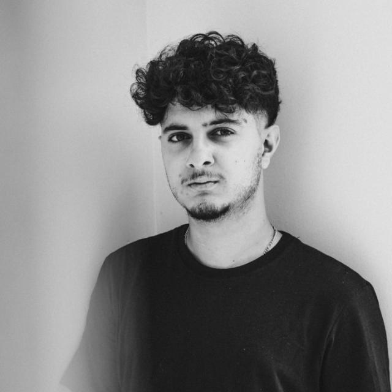
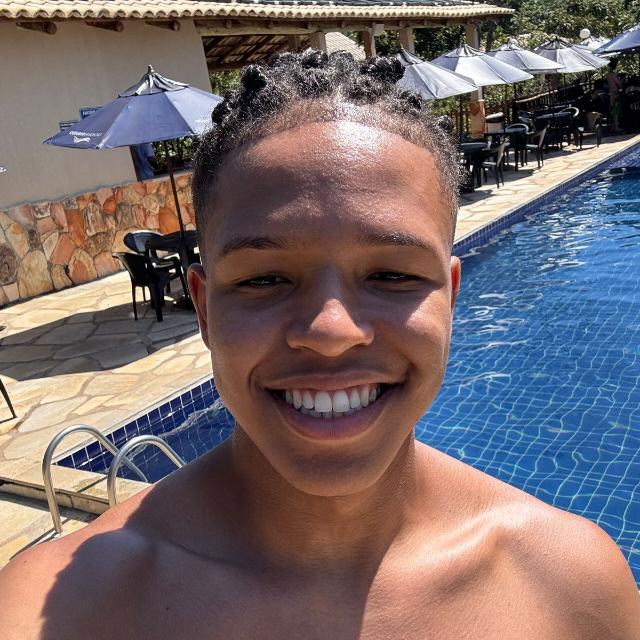

# GameDuo

Disciplina de Requisitos de Software - Turma 02 - 2026.2 | Universidade de Brasília (UnB/FGA)

Este é o site oficial da documentação do produto **GameDuo**.

---

## Sobre o Projeto

O **GameDuo** é uma plataforma que conecta jogadores para a contratação de sessões de **coaching** (orientação técnica) e parcerias remuneradas para jogar em dupla (**duo**) — do pareamento em jogos competitivos de alta exigência, como *League of Legends*, até jogos de alta dificuldade, como *Elden Ring*.

Hoje, esse tipo de contratação acontece de forma informal, por canais como WhatsApp e Discord, sem verificação de credenciais nem garantia de pagamento — o que gera desconfiança entre as partes. O GameDuo resolve isso com um fluxo de contratação padronizado e seguro, verificação do nível técnico (elo) dos prestadores e custódia do pagamento até a validação da sessão.

-   :material-account-voice: __Coaching Personalizado__

    ---

    Sessões individuais com jogadores experientes, focadas no erro específico de cada jogador.

-   :material-account-group: __Duo Remunerado__

    ---

    Parcerias de jogo pagas, para quem quer companhia ou apoio técnico durante a partida.

-   :material-shield-check-outline: __Segurança e Confiança__

    ---

    Verificação de credenciais, custódia de pagamento e moderação contra toxicidade.

---

## Navegação Rápida

Explore as seções da documentação do projeto por meio dos painéis interativos abaixo:

-   :material-clipboard-text-outline: __Visão do Produto e Projeto__

    ---

    Cenário atual do cliente, oportunidade de negócio, solução proposta e pesquisa de mercado.

    [Acessar Documentação](visao-produto/cenario-atual.md)

---

## Integrantes do Projeto

<ul class="gd-team">
  <li>
    <a class="gd-team__card" href="https://github.com/Guibs969" title="Desenvolvimento Backend (líder)">
      
      Guilherme Brandão
      @Guibs969
    </a>
  </li>
  <li>
    
      
      Paulo Lucca
    
      @Rukkakun
    
  </li>
  <li>
    <a class="gd-team__card" href="https://github.com/PedroAraujo004" title="Product Owner · Analista de Requisitos (líder)">
      
      Pedro Araujo
      @PedroAraujo004
    </a>
  </li>
  <li>
    <a class="gd-team__card" href="https://github.com/ChickRicks" title="Gerente de Projeto · QA · Banco de Dados (líder)">
      
      Ricardo Lucas
      @ChickRicks
    </a>
  </li>
  <li>
    
      
      Rodrigo Átila
      @Rodrigoatila09
    
  </li>
</ul>

---

## Histórico de Revisão

| Data | Versão | Descrição | Autor(es) |
|:---|:---|:---|:---|
| 02/09/2026 | 0.1 | Abertura do documento e estruturação inicial | Guilherme Brandão |
| 03/09/2026 | 0.2 | Primeira reunião com cliente  | Ricardo Lucas e Pedro Araujo |
| 05/09/2026 | 0.3 | Elaboração da seção 4 — Estratégias de Engenharia de Software |Equipe GoHorse |
| 05/09/2026 | 0.5 | adiciona mapa de stakeholders  e(sessão 1.6) | Pedro Araujo|  
| 06/09/2026 | 0.6 | 2.3  características do produto  | Pedro Araujo|   
| 06/09/2026 | 0.7 | Arrumado alguns detalhes, colocado 2.7 e 7.3  | Ricardo Lucas| 
| 06/09/2026 | 0.8 |  Viabilidade da Proposta e  Intervenção Social | Guilherme Brandão |
| 06/09/2026 | 0.9 |  5.0 Engenharia de Requisitos | Equipe GoHorse | 
| 06/09/2026 | 0.10 | 6.0 Cronograma  Entregas | Equipe GoHorse |
| 06/09/2026 | 0.11 | Licoes Aprendidas | Equipe GoHorse |
| 08/09/2026 | 0.12 | Adiciona video da entrega e ajusta navegação | Equipe GoHorse |