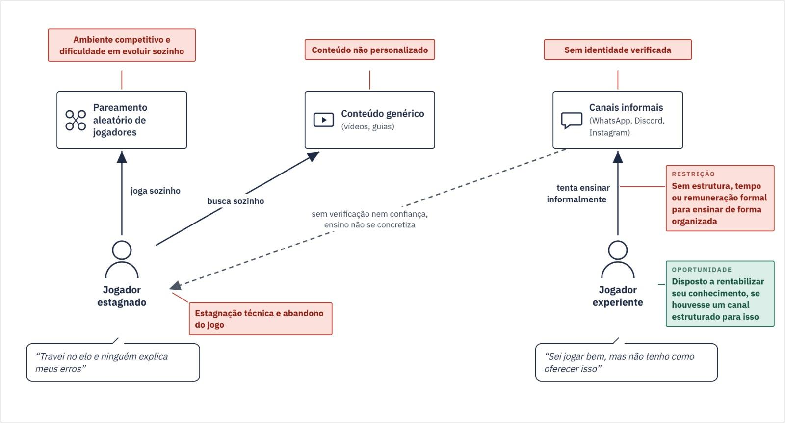
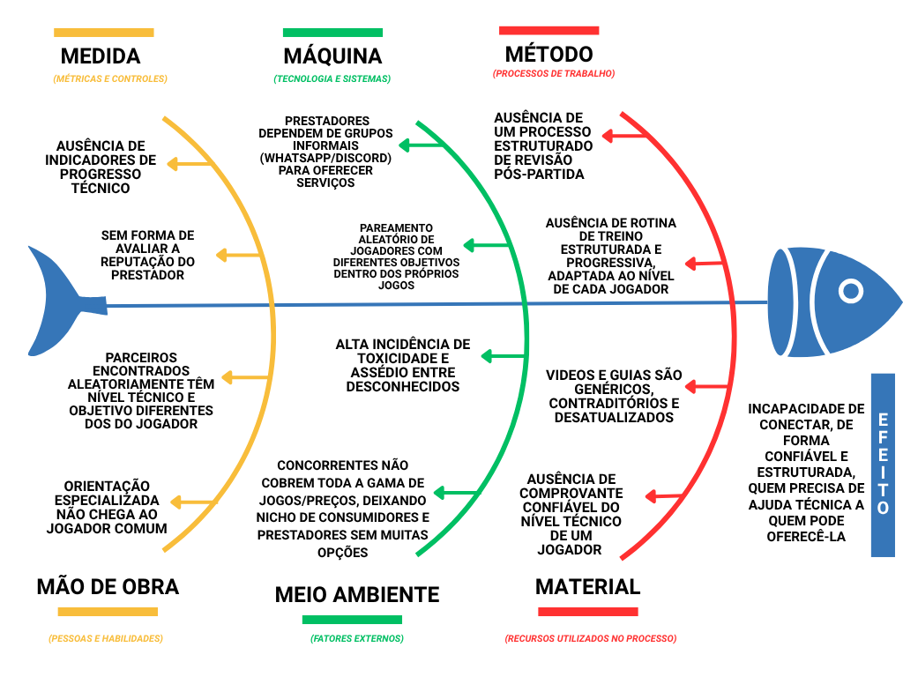
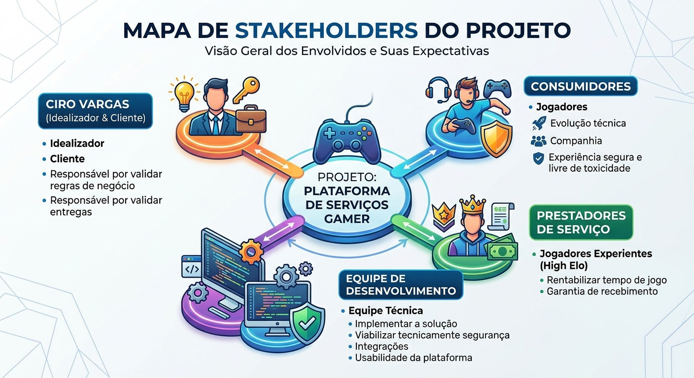

# Cenário Atual do Cliente e do Negócio

## 1.1 Identificação do Cliente/Parceiro

- **Nome:** Ciro Vargas
- **Tipo:** Pessoa Física (Idealizador / Empreendedor independente)
- **Representante:** Ciro Vargas
- **Forma de contato:** WhatsApp, Discord e Google Meet
- **Vínculo com o projeto:** Cliente. Principal stakeholder e especialista de domínio. Contato principal como tomador de decisões e responsável pelo alinhamento das necessidades do projeto.

## 1.2 Introdução ao Negócio e Contexto

O cliente do projeto é Ciro Vargas, idealizador e empreendedor independente da proposta GameDuo. Ciro atua há mais de 16 anos como arquiteto de software e tech lead, o que traz forte validação técnica para a viabilidade do produto.

O setor de atuação do projeto é o de entretenimento digital e e-sports, no segmento de serviços que conectam jogadores para orientação técnica (coaching) e formação de parcerias de jogo (duo). Esse mercado abrange desde jogos multiplayer competitivos de alta exigência técnica, como League of Legends (Riot Games), até jogos de alta dificuldade voltados à superação de desafios específicos, como Elden Ring (FromSoftware).

O público-alvo do GameDuo tem duas frentes: de um lado, jogadores que querem evoluir tecnicamente ou superar desafios específicos e não sabem onde buscar orientação confiável. Do outro lado, jogadores experientes que dominam determinado jogo e têm interesse em rentabilizar esse conhecimento por meio de coaching ou parceria remunerada.

## 1.3 Rich Picture

O cenário atual é fragmentado:

- **Jogador estagnado** joga em partidas de pareamento aleatório e busca sozinho conteúdo genérico, sem que nada corrija o seu erro específico, cometendo sempre os mesmos erros.
- O **jogador experiente** oferece ajuda por canais informais, que não verificam identidade nem nível técnico de forma confiável. O que dificulta gerar interesse em quem realmente precisa do serviço.

O fluxo de ensino (seta tracejada) raramente se concretiza e o ciclo termina em estagnação técnica e abandono do jogo.

## 1.4 Identificação da Oportunidade ou Problema

O problema central é a incapacidade de conectar, de forma confiável e estruturada, quem precisa de orientação técnica a quem pode oferecê-la no ecossistema de jogos online no Brasil. Isso aparece em duas frentes.

De um lado, jogadores que estagnam tecnicamente e não encontram um caminho claro para evoluir acabam abandonando o jogo. O material gratuito disponível (vídeos, guias genéricos) não considera o erro específico de cada jogador. Um estudo brasileiro sobre jogos educacionais adaptativos argumenta que ajustar dinamicamente a dificuldade e o conteúdo ao desempenho de quem joga tende a potencializar o aprendizado, mantendo o equilíbrio entre desafio e habilidade necessário para manter o engajamento (PISKE; MENEZES, 2015). Uma metanálise de 16 estudos controlados com mais de 53 mil alunos confirma esse efeito na prática: aprendizagem personalizada por tecnologia rendeu o equivalente a dois ou três meses a mais de progresso educacional, resultado que quase dobra quando o conteúdo se adapta ao nível real de cada aluno (MAJOR; FRANCIS; TSAPALI, 2021).

De outro lado, jogadores de elo alto que dominam o jogo e poderiam ensinar não têm um canal estruturado e focado no sistema de coaching. Hoje contam apenas com redes como Instagram, WhatsApp e Discord, que existem para conversar e compartilhar conteúdo, mas não foram pensadas para estruturar esse tipo de relação direta com quem procura o serviço. Pesquisa recente já trata a orientação técnica em e-sports como algo mensurável, avaliando treinadores por dimensões como motivação, estratégia e técnica (SANZ-MATESANZ et al., 2024), o tipo de estrutura que essas redes não oferecem.

Essa informalidade convive com um ambiente hostil nas próprias partidas. Levantamento com 1.022 jogadores brasileiros mostrou que 88% das mulheres relataram assédio moral (comentários desqualificando sua habilidade) e assédio sexual (perguntas pessoais indesejadas) em partidas online, contra 19% e 40% dos homens, respectivamente (STRAUSS et al., 2023). Esses números ajudam a explicar por que tantas jogadoras **silenciam o chat ou abandonam o jogo**.

Por fim, contratar essa orientação por **canais informais esbarra na falta de credibilidade das partes**. Isso não é exclusivo dos jogos: mesmo em plataformas formais de comércio eletrônico brasileiro, os índices de reputação exibidos nem sempre refletem a confiabilidade real de quem está sendo avaliado (FEITOSA; GARCIA, 2016). Sem uma forma padronizada de validar nível técnico e conduta, a desconfiança mútua permanece.

As causas dessa incapacidade de conectar, de forma confiável e estruturada, quem precisa de orientação técnica a quem pode oferecê-la estão sistematizadas no diagrama de Ishikawa abaixo.

## 1.5 Desafios do Projeto

Os principais obstáculos a serem superados incluem:

- **Validação do serviço:** Criar um mecanismo eficiente que confirme que as horas de call e a ajuda contratada foram efetivamente prestadas antes do pagamento ser efetuado.
- **Verificação de Credenciais:** Garantir a veracidade das informações dos prestadores (por exemplo, confirmar o "Elo" em jogos competitivos integrando, se possível, com APIs de terceiros).
- **Moderação e Segurança:** Implementar sistemas para evitar toxicidade, assédio e garantir um ambiente seguro, um desafio histórico em comunidades de jogos online.
- **Tração Inicial:** Atrair simultaneamente consumidores e prestadores de serviço.

## 1.6 Mapa de Stakeholders

Os principais stakeholders do projeto são: Ciro Vargas, como idealizador, cliente e principal responsável por validar as regras de negócio e as entregas; os consumidores, representados por jogadores que buscam evolução técnica ou companhia e esperam uma experiência de contratação segura e livre de toxicidade; os prestadores de serviço, que são os jogadores experientes (High Elo) interessados em rentabilizar seu tempo com garantia de recebimento; e a equipe de desenvolvimento, responsável por implementar a solução e viabilizar tecnicamente a segurança, as integrações e a usabilidade da plataforma.

A seguir, é apresentado um quadro resumo dos stakeholders.

| Stakeholder | Relação com a solução | Interesse principal | Influência |
|:---|:---|:---|:---|
| **Ciro Vargas** | Idealizador e Cliente | Validar o modelo de negócio, as prioridades, a segurança das transações e as entregas do MVP. | Alta |
| **Consumidores** (Jogadores comuns) | Usuários finais (Demanda) | Contratar serviços de coaching ou duo de forma segura, sem risco de fraudes ou assédio. | Média |
| **Prestadores** (Jogadores High Elo) | Usuários finais (Oferta) | Rentabilizar seu conhecimento técnico de forma estruturada e com garantia do repasse financeiro. | Média |
| **Equipe de desenvolvimento** | Responsável pela construção do produto | Entregar uma plataforma funcional, segura e viável dentro do prazo acadêmico estabelecido. | Alta |

## 1.7 Segmentação de Clientes

A plataforma atenderá a dois perfis principais (B2C):

- **Consumidores (Demanda):** Público gamer em geral que enfrenta dificuldades para superar estágios de um jogo ou nível competitivo; pessoas buscando aprimoramento técnico (coaching em e-sports); e pessoas buscando companhia (Duo) para jogar online.
- **Prestadores (Oferta):** Jogadores de alto rendimento (High Elo), especialistas em jogos específicos ou jogadores casuais dispostos a monetizar seu tempo livre jogando e auxiliando outras pessoas.
