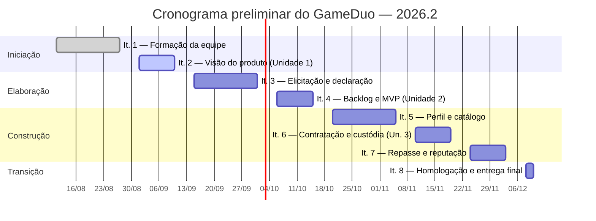

# 6 Cronograma e Entregas

A partir da estratégia definida na seção [Estratégias de Engenharia de Software](../estrategias/) — abordagem ágil, ciclo de vida iterativo e incremental e processo **OpenUP** —, o planejamento temporal do GameDuo foi organizado em iterações agrupadas nas quatro fases do OpenUP e ancoradas no calendário da disciplina.

Três decisões orientaram esse desenho:

- **As iterações encerram junto com as Unidades da disciplina.** O calendário de Requisitos de Software divide o semestre em quatro Unidades, cada uma com uma semana de entrega ao final. As iterações do projeto foram dimensionadas em duas ou três semanas para que nenhuma entrega da disciplina caia no meio de uma iteração.
- **Cada iteração encerra com validação do cliente.** Como definido na seção [Interação entre Equipe e Cliente](../interacao-equipe/), a equipe se reúne quinzenalmente com Ciro Vargas. Toda iteração termina em uma dessas reuniões, de modo que o ciclo se encerre com validação, e não apenas com entrega interna.
- **A atividade de ER é aplicada na Unidade em que é estudada.** Os temas de cada Unidade — elicitação e declaração na Unidade 2, representação e validação na Unidade 3 — definem qual atividade da Engenharia de Requisitos concentra o esforço em cada iteração.

Este planejamento é **preliminar** e será atualizado ao final de cada iteração, conforme previsto no próprio OpenUP e nas retrospectivas de cada Unidade.

---

## 6.1 Visão geral das fases

| Fase do OpenUP | Período | Iterações | Marco de encerramento | Unidade da disciplina |
| -------------- | ------- | --------- | --------------------- | --------------------- |
| **Iniciação** | 11/08/2026 – 10/09/2026 | 1 e 2 | **Objetivos do Ciclo de Vida** — problema, escopo e visão do produto acordados com o cliente | Unidade 1 |
| **Elaboração** | 15/09/2026 – 15/10/2026 | 3 e 4 | **Arquitetura do Ciclo de Vida** — requisitos estabilizados, riscos estruturais reduzidos por provas de conceito e MVP definido | Unidade 2 |
| **Construção** | 20/10/2026 – 03/12/2026 | 5, 6 e 7 | **Capacidade Operacional Inicial** — MVP funcional, integrado e testado | Unidades 3 e 4 |
| **Transição** | 08/12/2026 – 10/12/2026 | 8 | **Release do Produto** — produto homologado e aceito pelo cliente | Unidade 4 |

---

## 6.2 Detalhamento das iterações

| Iteração | Fase | Início | Fim | Objetivo principal | Entregas esperadas | Validação do cliente |
| -------- | ---- | ------ | --- | ------------------ | ------------------ | -------------------- |
| **1** | Iniciação | 11/08/2026 | 27/08/2026 | Formação da equipe e definição do domínio do projeto | - Definição dos papéis da equipe GoHorse - Repositório e site do projeto (GitPages) configurados - Prospecção e primeiro contato com o cliente | Alinhamento inicial sobre disponibilidade, forma de contato e interesse no projeto |
| **2** | Iniciação | 01/09/2026 | 10/09/2026 | Compreensão do problema e construção da visão do produto | - **Entrega da Unidade 1:** documento de Visão do Produto e Projeto (seções 1 a 7) - Rich picture, diagrama de Ishikawa e mapa de stakeholders - Objetivos específicos (OE1–OE5) e características de produto (CP1–CP6) - Estratégia de engenharia de software e plano de ER definidos | Primeira reunião com o cliente: validação do problema central, do modelo de negócio e do escopo pretendido |
| **3** | Elaboração | 15/09/2026 | 01/10/2026 | Elicitação, análise e declaração dos requisitos | - Glossário do domínio - Listas preliminares de requisitos funcionais e não funcionais (URPS+) - User stories com critérios de aceitação em BDD - Prova de conceito da verificação de Elo via API de terceiros | Validação dos requisitos declarados e do que é tecnicamente verificável na integração de credenciais |
| **4** | Elaboração | 06/10/2026 | 15/10/2026 | Definição do backlog, do MVP e redução do risco de pagamento | - **Entrega da Unidade 2:** backlog do produto priorizado, MVP definido, DoR e DoD - Matriz de rastreabilidade (OE → CP → VN → RF → RNF) - Prova de conceito da custódia e do split de pagamento | Homologação do backlog priorizado e do recorte do MVP |
| **5** | Construção | 20/10/2026 | 05/11/2026 | Primeiro incremento: identidade e descoberta de prestadores | - Cadastro e perfil de usuário com verificação de credenciais (CP1) - Catálogo e busca de serviços por jogo, nível, preço e tipo (CP2) - Protótipos e diagramas de caso de uso da jornada de contratação | Demonstração do incremento: o consumidor consegue encontrar e avaliar um prestador verificado |
| **6** | Construção | 10/11/2026 | 19/11/2026 | Segundo incremento: contratação e custódia | - **Entrega da Unidade 3** - Fluxo de contratação com retenção de créditos em custódia (CP3) - Gestão da sessão e chat integrado entre as partes (CP6) - Verificação e validação dos requisitos implementados | Validação do fluxo de contratação de ponta a ponta, incluindo os caminhos de exceção |
| **7** | Construção | 24/11/2026 | 03/12/2026 | Terceiro incremento: validação bilateral, repasse e confiança | - Validação bilateral da sessão e repasse automático ao prestador (CP3) - Avaliação cruzada, reputação e canal de denúncias (CP4) - Painel administrativo de transações, disputas e usuários (CP5) - Backlog e matriz de rastreabilidade atualizados | Validação do ciclo completo da transação e das regras de moderação |
| **8** | Transição | 08/12/2026 | 10/12/2026 | Homologação, entrega e encerramento | - **Entrega final (Unidade 4):** MVP integrado, corrigido e testado - Testes de aceitação com usuários dos dois perfis (consumidor e prestador) - Documentação consolidada e lições aprendidas - Apresentação final do produto | Homologação e aceite formal do produto pelo cliente |

---

## 6.3 Entregas por Unidade da disciplina

| Unidade | Período | Entrega | Produtos gerados |
| ------- | ------- | ------- | ---------------- |
| **Unidade 1** | 11/08/2026 – 10/09/2026 | 10/09/2026 | Visão do Produto e Projeto (seções 1 a 7): cenário atual, solução proposta, intervenção social, estratégias de engenharia de software, engenharia de requisitos, cronograma e interação com o cliente |
| **Unidade 2** | 15/09/2026 – 15/10/2026 | 15/10/2026 | Requisitos funcionais e não funcionais, matriz de rastreabilidade, DoR e DoD, backlog do produto priorizado e definição do MVP |
| **Unidade 3** | 20/10/2026 – 19/11/2026 | 19/11/2026 | Incrementos de software validados com o cliente, representação e validação dos requisitos, documento de Visão atualizado e lições aprendidas da Unidade |
| **Unidade 4** | 24/11/2026 – 10/12/2026 | 10/12/2026 | MVP homologado, documentação consolidada, lições aprendidas e apresentação final |

---

## 6.4 Representação temporal

---

## 6.5 Considerações importantes

1. **Duração das iterações.** As iterações têm duas ou três semanas. As de três semanas (1, 3 e 5) abrem cada bloco da disciplina e concentram o trabalho de descoberta e construção; as de duas semanas (2, 4, 6 e 7) fecham o bloco e coincidem com a semana de entrega da Unidade. A Iteração 8 tem uma semana e existe apenas para homologação e encerramento.

2. **Validação ao final de cada iteração.** Toda iteração encerra com uma reunião de validação com Ciro Vargas, por Google Meet ou Discord. Nas iterações de três semanas há uma reunião intermediária, preservando a cadência quinzenal definida na seção 7.2. Dúvidas pontuais entre as reuniões seguem por WhatsApp.

3. **Riscos estruturais tratados antes da Construção.** As provas de conceito da verificação de Elo (Iteração 3) e da custódia com split de pagamento (Iteração 4) foram deliberadamente posicionadas na fase de Elaboração. São as duas decisões mais caras de reverter, e o marco de Arquitetura do Ciclo de Vida só é considerado atingido quando ambas estiverem resolvidas.

4. **Entregas incrementais alinhadas ao MVP.** As Iterações 5, 6 e 7 constroem, nessa ordem, os três passos da proposta de valor central: encontrar um prestador confiável, contratar a sessão e concluir a transação com segurança para as duas partes. Cada incremento é utilizável e validado antes que o seguinte comece.

5. **Folga concentrada no fim do semestre.** A Unidade 4 é a mais curta do calendário. Por isso, o MVP é fechado ao final da Iteração 7, em 03/12, e a última semana fica reservada para correções, homologação e apresentação — sem funcionalidade nova prevista.

6. **Atualização sucessiva do planejamento.** Ao final de cada iteração, o cronograma é revisado à luz do que foi efetivamente entregue e das mudanças de prioridade acordadas com o cliente. As alterações são registradas no histórico de revisão do documento, no GitPages.

7. **Retrospectiva por Unidade.** Ao final de cada Unidade, a equipe realiza uma retrospectiva cujos resultados são registrados na seção de Lições Aprendidas, incluindo as dificuldades enfrentadas e as ações de melhoria adotadas.
